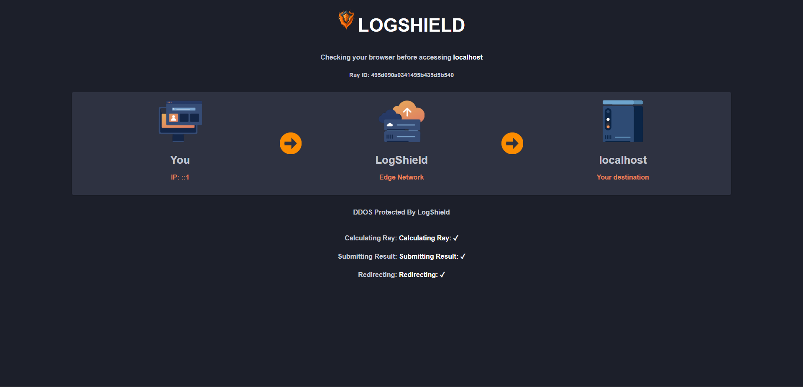

# LogShield

LogShield is a comprehensive machine learning project that leverages the powerful TensorFlow.js to monitor and detect malicious activity in both web server access and login logs. This robust system offers a safeguard for your server, detecting and flagging suspicious behaviors to help protect against potential security breaches.

Powered by an intricate Recurrent Neural Network (RNN) model, LogShield specializes in sequential data understanding. This allows it to comprehend the temporal dependencies in the logs and accurately identify patterns of harmful activity. This approach is especially effective for login logs, where the sequence of attempts may indicate harmful intent.

By incorporating a machine learning model, LogShield goes beyond traditional rule-based systems to offer dynamic and adaptable protection. It is designed to learn and improve over time, refining its ability to discern legitimate from malicious activity, and delivering a progressively robust defense for your web server.

Whether it's protection from Distributed Denial of Service (DDoS) attacks, brute-force login attempts, or other types of malicious activity, LogShield offers a state-of-the-art, machine learning-powered solution to bolster the security of your web server.

<p align="center">
    
</p>

## How it works

# Middleware:

LogShield also includes a rate limiter feature to prevent abuse of the web server by limiting the number of requests from a single IP address within a specified time period. The rate limiter uses Redis as a storage backend to keep track of the number of requests made by each IP address.

The rate limiter can be configured with the following options:

. limit: the maximum number of requests allowed within the specified time period (default: 30).
. resetInterval: the time period in milliseconds after which the request count for an IP address should be reset (default: 1 minute).
. blockDuration: the time period in milliseconds for which requests from an IP address should be blocked after exceeding the limit (default: 2 minutes).
. nonceLimit: the maximum number of nonces allowed within the specified time period (default: 10).
. nonceWindow: the time period in milliseconds after which the nonce count for an IP address should be reset (default: 5 seconds).

Mass GET requests (3817)

```powershell
checks.........................: 0.26%  ✓ 10        ✗ 3817
data_received..................: 1.8 MB 29 kB/s
data_sent......................: 429 kB 7.0 kB/s
http_req_blocked...............: avg=56.39µs min=0s      med=0s      max=4.27ms  p(90)=0s      p(95)=0s
http_req_connecting............: avg=25.97µs min=0s      med=0s      max=3.01ms  p(90)=0s      p(95)=0s
http_req_duration..............: avg=12.73ms min=1.52ms  med=11.05ms max=66.48ms p(90)=23.5ms  p(95)=25.53ms
  { expected_response:true }...: avg=61.43ms min=57.89ms med=58.89ms max=66.48ms p(90)=66.48ms p(95)=66.48ms
http_req_failed................: 99.73% ✓ 3817      ✗ 10
http_req_receiving.............: avg=4.34ms  min=0s      med=3.66ms  max=19.72ms p(90)=8.08ms  p(95)=10.99ms
http_req_sending...............: avg=5.12µs  min=0s      med=0s      max=1ms     p(90)=0s      p(95)=0s
http_req_tls_handshaking.......: avg=0s      min=0s      med=0s      max=0s      p(90)=0s      p(95)=0s
http_req_waiting...............: avg=8.39ms  min=502.4µs med=7.18ms  max=65.05ms p(90)=14.49ms p(95)=19.3ms
http_reqs......................: 3827   62.710117/s
iteration_duration.............: avg=1.01s   min=1s      med=1.01s   max=1.06s   p(90)=1.02s   p(95)=1.02s
iterations.....................: 3827   62.710117/s
vus............................: 41     min=41      max=64
vus_max........................: 64     min=64      max=64
```

Blocked 99.73% of 3817 requests

## Environment Variables

The following environment variables are used in the application:

| Variable            | Description                           | Example Value                                      |
|---------------------|---------------------------------------|----------------------------------------------------|
| SECRET              | Secret key for session encryption     | sg809psargae9pr8gaertgheho9ar8g                    |
| DIFFICULTY          | Difficulty level for the proxy server  | 0                                                  |
| PORT                | Port number for the proxy server       | 7000                                               |
| TARGETURL           | URL of the target server to proxy      | http://127.0.0.1:3000                              |
| WHITELISTED         | Whitelisted IP addresses               | 127.0.0.1                                          |
| Redis_Username      | Username for Redis database connection | default                                            |
| Redis_Password      | Password for Redis database connection | qVFxATVuYmGMwJRengkJYm1Z0cz9V8bi                    |
| Redis_Host          | Host address for Redis database         | redis-15979.c21.us-east-1-3.ec2.cloud.redislabs.com |
| Redis_Port          | Port number for Redis database          | 6000                                              |
| Session_Time        | Session expiration time in minutes     | 30                                                 |
| Max_Requests        | Maximum number of requests per minute  | 100000                                             |
| Reset_Interval      | Request rate limiter reset interval (Per 1 min)   | 1                                       |
| BlockDuration       | Duration to block IP for rate limiting (Per 1 min) | 2                                      |

1. Install Node.js and the required packages by running the following command in your terminal:

```
npm i
```
2. Start the script:
```
npm start
```

## Installing

```sh
apt-get update && apt-get upgrade -y
curl -fsSL https://deb.nodesource.com/setup_19.x | sudo -E bash -
apt-get install -y nodejs nginx
mkdir -p /etc/logshield
cd /etc/logshield

# Upload the files

npm install
cp example.env .env
# Edit .env
cp logshield.service /etc/systemd/system/logshield.service
systemctl enable --now logshield
```

## Updating

```sh
cd /etc/logshield
# upload new files
cp logshield.service /etc/systemd/system/logshield.service
systemctl daemon-reload
systemctl restart logshield
```
